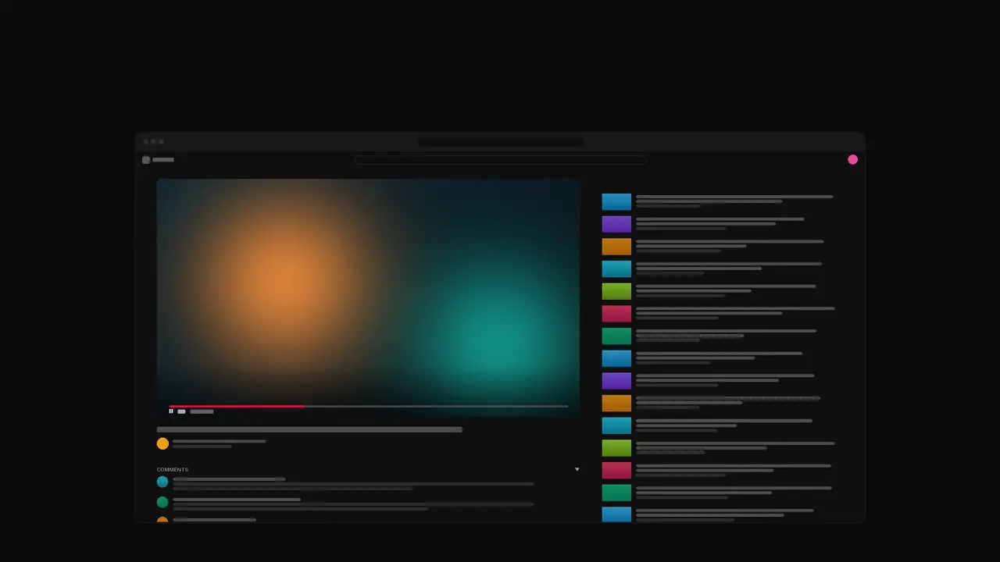

  

<h1 align="center">Split for YouTube</h1>

<strong>Read the comments without losing the video.</strong>

  
  
  

  A free Chrome extension that puts the video on the left and everything else on the right. 
  <a href="https://junjing02.github.io/split-for-youtube/">See it in action →</a>

  
   
  <a href="https://junjing02.github.io/split-for-youtube/demo.mp4">▶ Watch the demo in full quality</a>

---

## Features

- **Always in view** — the video keeps its own column while you scroll comments and recommendations.
- **Resizable** — drag any divider (double-click to reset it), and collapse any section with one click.
- **Adapts to the video** — vertical videos get an even split, and when the side pane is wide, recommendations and comments sit side by side.
- **Ambient light** — the video's colors glow softly behind the page, in light theme too, which YouTube itself doesn't offer.
- **Two windows** — keep the video here and the comments in a second window, always in sync.
- **Thoughtful defaults** — live chat, light and dark themes, and the end of a video are all handled for you.
- **Yours to tune** — a toolbar panel to switch things on and off, set the glow strength, remember your layout or put the video on the right.
- **Keyboard friendly** — shortcuts for the split and Two windows, and dividers and pane titles you can reach with Tab.
- **Out of the way** — theater mode and small windows get YouTube's normal layout.

## Install

1. [Download `split-for-youtube.zip`](https://github.com/junjing02/split-for-youtube/releases/latest/download/split-for-youtube.zip) and unzip it.
2. Open `chrome://extensions` and turn on **Developer mode**.
3. Click **Load unpacked** and choose the `split-for-youtube` folder.

Works in Chrome, Edge, Brave and other Chromium browsers. To update, replace the folder with the latest download and click reload on the extension's card.

## Two windows

Click the extension's toolbar icon and switch on **Two windows**. The video fills your window; the description, recommendations and comments open in a second one.

- Click a video or a timestamp in the second window, and your window follows.
- Leave the video and the second window closes; open another and it comes back.
- Make the second window wide and its panes sit side by side; narrow, and they stack. Either way you can drag between them.
- Close the second window to return to the split.

## Settings and shortcuts

Click the extension's toolbar icon for the settings: the split itself, Two windows, ambient light and its strength, **Remember my layout**, and **Video on the right**.

- `Alt+Shift+S` turns the split on or off, and `Alt+Shift+W` toggles Two windows. Change them at `chrome://extensions/shortcuts`.
- Double-click a divider to reset it. With a divider focused, the arrow keys move it.
- Ambient light works in light and dark themes. In dark theme it also follows YouTube's own Ambient mode.

## Privacy

Everything runs in your browser. Nothing is collected and nothing is sent anywhere. The extension asks only for access to youtube.com, to rearrange the page, and for storage, to remember your settings.
